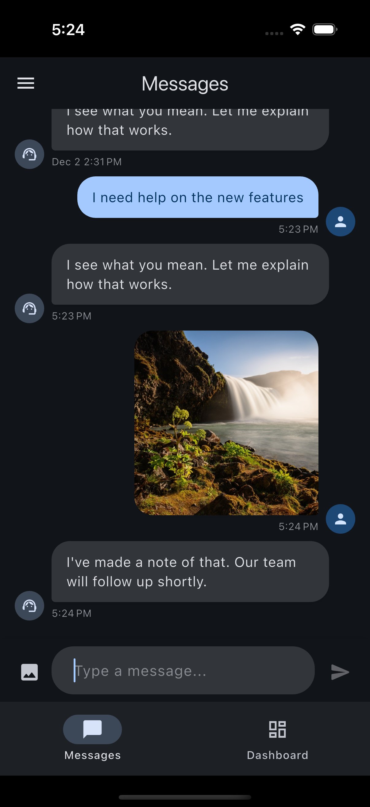
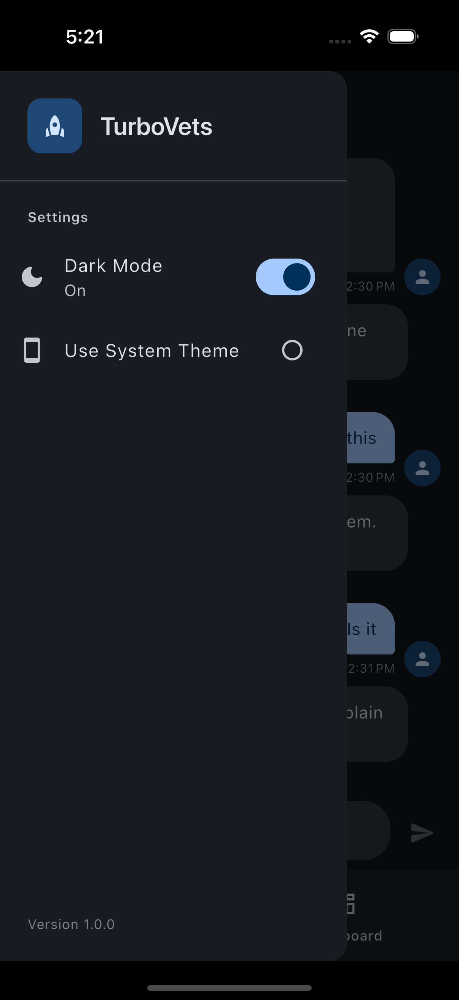
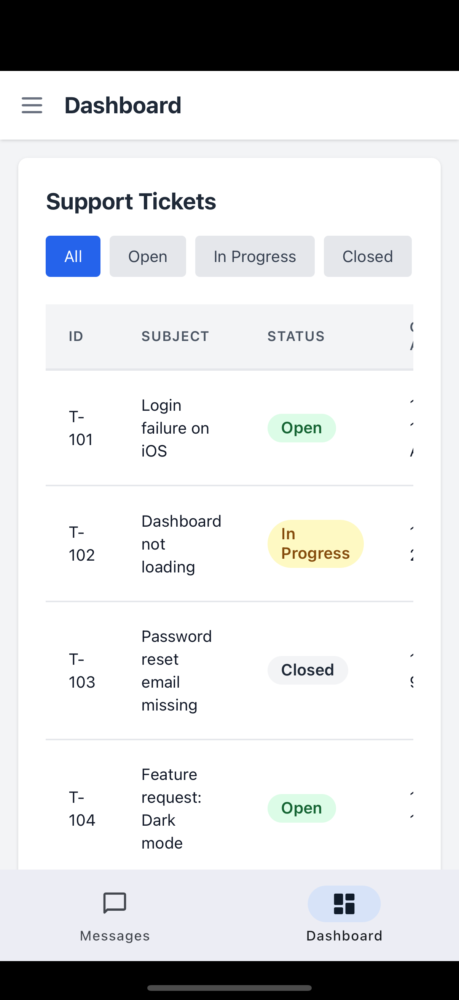
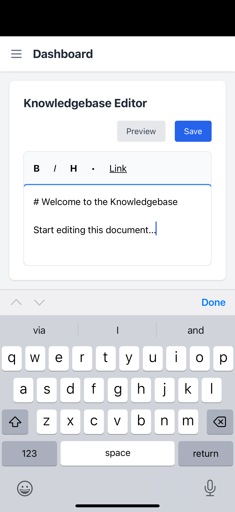
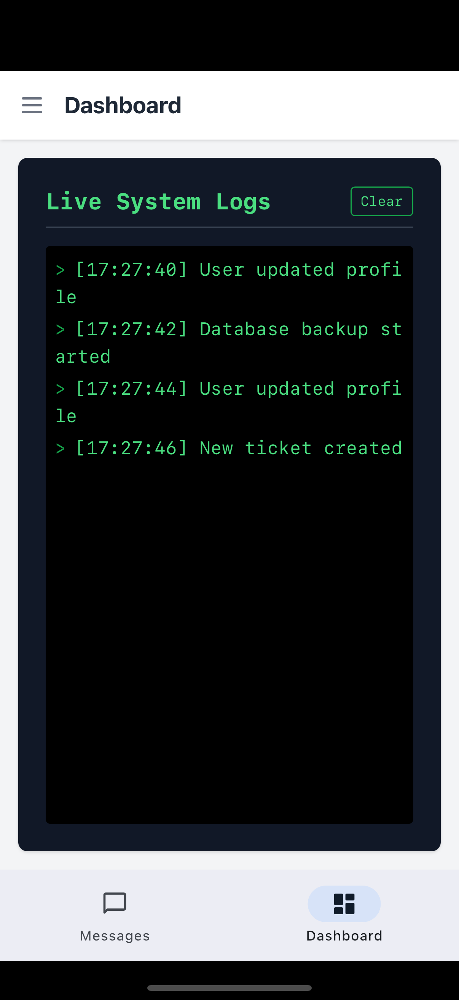
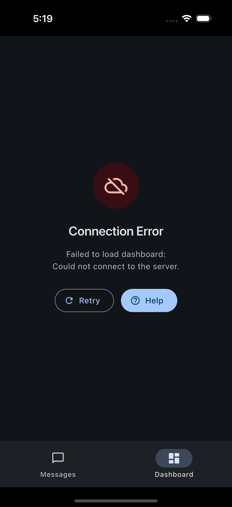

# Messaging App with Embedded Internal Tools Dashboard

A full-stack mobile application featuring a native Flutter messaging interface with an embedded Angular + Tailwind CSS internal tools dashboard, served via WebView.

## Quick Start

### Prerequisites

- **Flutter SDK** 3.9.2 or higher
- **Node.js** 18+ and npm
- **Angular CLI** (`npm install -g @angular/cli`)
- iOS Simulator or Android Emulator

### Running the Project

#### Step 1: Start the Angular Dashboard Server

```bash
cd webpage
npm install
npm start
```

The server will start at `http://0.0.0.0:4200` (accessible from both iOS and Android emulators).

#### Step 2: Run the Flutter App

Open a new terminal:

```bash
cd flutter_app
flutter pub get
flutter run
```

#### Platform-Specific Notes

| Platform             | Dashboard URL    | Notes                              |
| -------------------- | ---------------- | ---------------------------------- |
| **iOS Simulator**    | `localhost:4200` | Works directly with host localhost |
| **Android Emulator** | `10.0.2.2:4200`  | Maps to host machine's localhost   |

The app automatically detects the platform and uses the correct URL.

---

## Project Overview

This project demonstrates cross-technology integration between:

1. **Flutter** - Native mobile messaging interface with persistent storage
2. **Angular + Tailwind CSS** - Internal tools dashboard embedded via WebView

### Why This Architecture?

The project uses a **minimalistic Clean Architecture** approach for the Flutter app. Traditional Clean Architecture includes layers like DTOs, Use Cases, and Mappers, which add boilerplate. For this project's scope, I simplified by:

- **Removing Use Cases** - Direct repository access from Cubits (acceptable for simple CRUD operations)
- **Removing DTOs** - Domain entities used directly (no complex API transformations needed)
- **Keeping Core Separation** - Domain, Data, and Presentation layers remain distinct

This balance maintains testability and separation of concerns while avoiding over-engineering.

---

## Architecture

### Flutter App Structure

```
flutter_app/lib/
├── core/
│   ├── constants/          # App-wide constants, URLs, responses
│   └── theme/              # Light/Dark theme definitions & ThemeCubit
└── features/
    ├── messaging/
    │   ├── domain/
    │   │   ├── entities/       # Message entity
    │   │   └── repositories/   # Repository interface
    │   ├── data/
    │   │   ├── adapters/       # Hive TypeAdapter
    │   │   └── repositories/   # Hive implementation
    │   └── presentation/
    │       ├── pages/          # Chat screen
    │       ├── state/          # MessageCubit & states
    │       └── widgets/        # Chat bubble, message input
    └── dashboard_webview/
        └── presentation/
            └── pages/          # WebView with error handling
```

### Angular Dashboard Structure

```
webpage/src/app/
├── sidebar/                # Navigation sidebar
├── ticket-viewer/          # Support tickets module
├── knowledgebase/          # Markdown editor module
├── live-logs/              # Real-time logs module
└── mock-data.service.ts    # Shared dummy data service
```

---

## Features

### Flutter App

- **Native Chat UI** - Incoming/outgoing chat bubbles with avatars
- **Timestamps** - Human-readable timestamps (today shows time only)
- **Auto-Scroll** - Automatically scrolls to latest message
- **Simulated Agent** - Random responses from preset list with typing indicator
- **Image Messages** - Send images from camera or gallery
- **Emoji Support** - Native keyboard emoji support
- **Message Persistence** - Chat history saved with Hive (survives app restart)
- **Dark Mode** - Toggle via settings drawer (Light/Dark/System)
- **WebView Dashboard** - Embedded Angular app with loading & error states
- **Bottom Navigation** - Switch between Messages and Dashboard tabs

### Angular Dashboard

- **Ticket Viewer** - Table with dummy tickets, filterable by status (Open/In Progress/Closed)
- **Knowledgebase Editor** - Custom markdown editor with live preview (ngx-markdown)
- **Live Logs Panel** - Simulated real-time logs with auto-scroll and smooth animations
- **Sidebar Navigation** - Angular routing between modules
- **Responsive Design** - Mobile-first, optimized for WebView viewport

---

## Tech Stack

### Flutter App

| Package           | Version | Purpose                           |
| ----------------- | ------- | --------------------------------- |
| `flutter_bloc`    | 8.1.6   | State management (Cubit)          |
| `equatable`       | 2.0.7   | Value equality for state classes  |
| `hive_ce`         | 2.11.3  | Local storage (Community Edition) |
| `hive_ce_flutter` | 2.2.0   | Flutter bindings for Hive         |
| `webview_flutter` | 4.13.0  | Embedded web content              |
| `image_picker`    | 1.2.1   | Camera/gallery image selection    |
| `intl`            | 0.19.0  | Date/time formatting              |

### Angular Dashboard

| Technology   | Version | Purpose                    |
| ------------ | ------- | -------------------------- |
| Angular      | 16.2.0  | Frontend framework         |
| Tailwind CSS | 3.4.18  | Utility-first styling      |
| ngx-markdown | 16.0.0  | Markdown preview rendering |
| TypeScript   | 5.1.3   | Type-safe JavaScript       |

---

## Configuration

### WebView URLs

URLs are configured in `flutter_app/lib/core/constants/app_constants.dart`:

```dart
static const String dashboardUrlIOS = 'http://localhost:4200';
static const String dashboardUrlAndroid = 'http://10.0.2.2:4200';
```

---

## Assumptions & Decisions

1. **No Backend** - All data is simulated (agent responses, tickets, logs)
2. **Local Storage Only** - Messages persist via Hive, no cloud sync
3. **Simplified Clean Architecture** - Removed use cases/DTOs for project scope
4. **Hive CE** - Used community edition as original Hive is no longer maintained
5. **Custom Markdown Editor** - Built lightweight editor instead of heavy WYSIWYG packages

---

## Bonus Features Implemented

- Message persistence (Hive)
- Emoji support (native keyboard)
- Image messages (camera + gallery)
- Dark mode toggle
- Log animations in Live Logs panel
- Markdown preview in Knowledgebase editor
- Typing indicator animation
- WebView error handling with retry
- Unit tests for Flutter app (Cubits, Entities, Repository)

---

## Testing

Unit tests are included for the Flutter app covering:

- **Message Entity** - Factory methods, equality, getters
- **MessageRepository** - CRUD operations, edge cases
- **MessageCubit** - State management with mocked repository
- **ThemeCubit** - Theme switching and toggles

Run tests:

```bash
cd flutter_app
flutter test
```

---

## 📸 Screenshots

### Flutter App

| Chat Page                               | Dark Mode                               |
| --------------------------------------- | --------------------------------------- |
|  |  |

### Angular Dashboard (in WebView)

| Dashboard                                       | Knowledgebase Editor                                   |
| ----------------------------------------------- | ------------------------------------------------------ |
|  |  |

| Live Logs Panel                                  |
| ------------------------------------------------ |
|  |

### Error Handling

| Connection Error                                              |
| ------------------------------------------------------------- |
|  |

---

## 📝 License

This project was created as a technical assessment.
